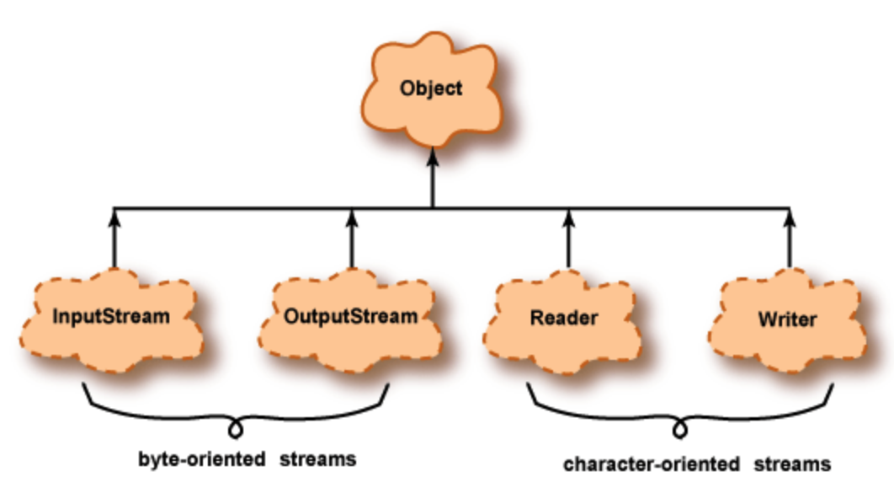
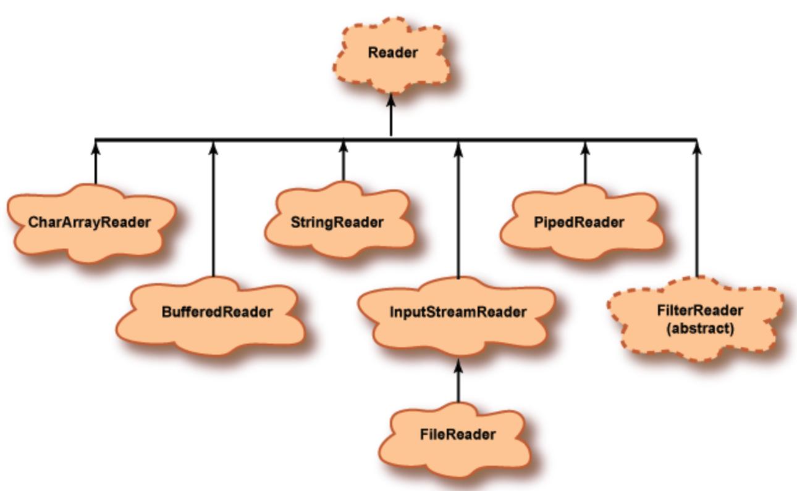
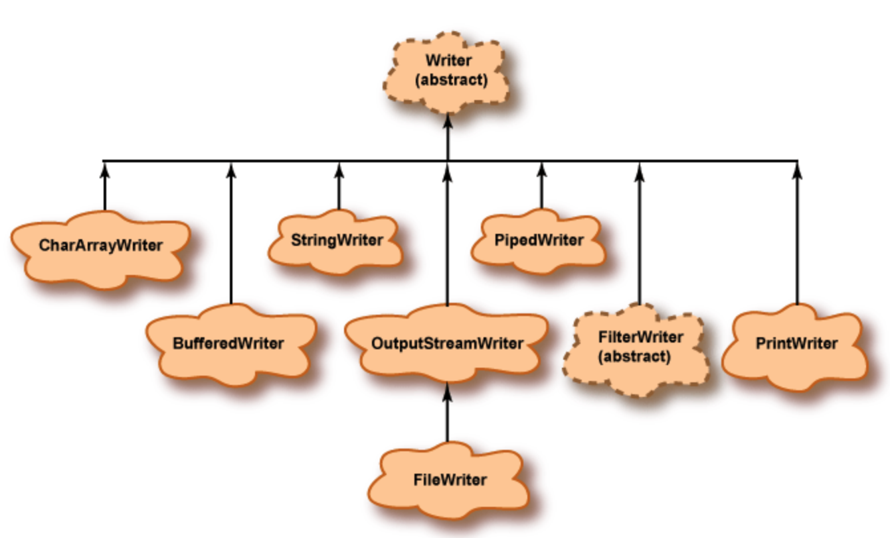
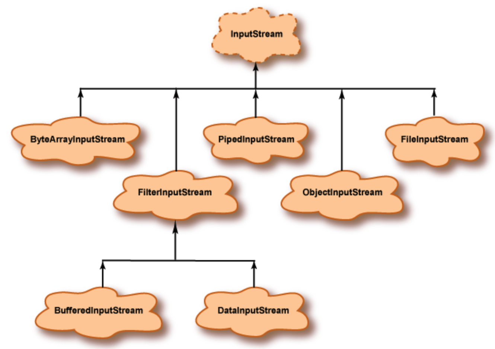
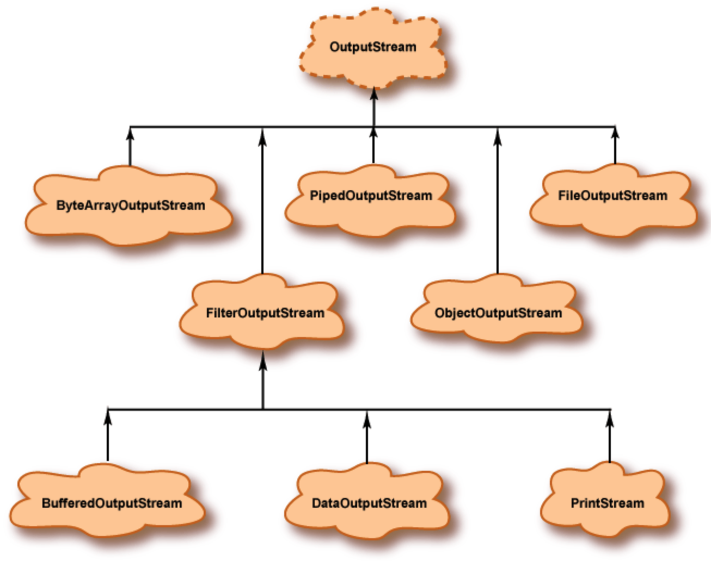

# I/O Streams

A `stream` is a sequence of data flowing from a source to a destination. `I/O streams` can be connected to a wide variety of data sources and destinations.

A stream object may be:

* An `input stream` or an `output stream`,
* a `character-oriented stream` or a `byte-oriented stream`,
* a `processing stream` or an `ordinary stream`,
* and may be connected to a variety of sources or destinations.

Not only are there many types of streams, there are many ways to connect them together. I/O is a big topic because of the wide variety of I/O devices and the wide variety of data formats.

## Hierarchy

An `input stream` handles data flowing into a program. It is the raw method of getting information from a source. It grabs the data byte by byte without performing any kind of translation. If you are reading image data, or any binary file/data, this is the stream to use.

A `Reader` is designed for `character streams`. If the information you are reading is all text, then the Reader will take care of the character decoding for you and give you unicode characters (or defined charset) from the raw input stream. If you are reading any type of text, this is the stream to use. In Java, you can wrap an `InputStream` and turn it into a Reader by using the `InputStreamReader` class.

An `output stream` handles data flowing out of a program.

The goal of `InputStream` and `OutputStream` is to abstract different ways to input and output: regardless of whether the stream is a file, a web page, or text. All that matters is that you receive information from the stream (or send information into that stream.)

## Processing Streams

A `processing stream` operates on the data supplied by another stream. Often a processing stream acts as a buffer for the data coming from another stream. A `buffer` is a block of main memory used as a work area.

For example, disks usually deliver data in blocks of 512 bytes, no matter how few bytes a program has asked for. Usually the blocks of data are buffered and delivered from the buffer to the program in the amount the program asked for.

Example, the keyboard sends data to the **InputStream** `System.in` which is connected to a **InputStreamReader** stream which is connected to a **BufferedReader** stream. `System.in` is a stream object that the Java system automatically creates when your program starts running. The data is transformed along the way. The raw bytes from the keyboard are grouped together into a `String` object that the program reads using `stdin.readLine()`.

## Character Streams and Byte Streams

Fundamentally all data consist of patterns of bits grouped into 8-bit bytes. So, logically all streams could be called `byte streams`. `Byte streams` are intended for general purpose input and output. And data may be primitive data types or raw bytes.

`Character streams` are exclusively `optimized for character data` and perform some other useful character-oriented tasks. Often the source or destination of a character stream is a text file, a file that contains bytes that represent characters.

Inside a Java program character data is represented with the `16-bit char` data type. While on a disk file, characters are represented in a format called `UTF (Unicode Transformation Format)`. This format uses one to four bytes per character and is intended to be a universal format—one format for all text files in any language anywhere in the world. In Character streams, data is transformed from/to `16 bit Java char` used inside programs to the `UTF format` used externally.

Usually a UTF text file is identical to an ASCII text file. `ASCII` is the standard way to represent characters that most computers have used for the past forty years. A file created with a text editor is usually an ASCII text file. A UTF text file can include non-ASCII characters such as Cyrillic, Greek, and Asian characters. By reading and writing UTF files, Java programs can process text from any of the World's languages.

> Note: the bytecode file created by the Java compiler contains machine instructions for the Java virtual machine. These are not intended to represent characters, and input and output of them must use byte streams. Similar is the case with image files, audio files, executable files, etc.

## Readers and Writers

`Readers` and `Writers` deal with character streams. These are abstract classes. A program must use classes derived from them. For example, a `BufferedReader` is a Reader, and `OutputStreamWriter` is a Writer.

All the Readers are aimed at receiving 16-bit char data from a program, and all the Writers aim at sending the 16-bit char data to another destination, which may use a different character format (such as UTF format on a disk file).

## InputStream and OutputStream

`InputStream` is an abstract class from which all byte-oriented input streams are derived. Its descendant classes are used for general-purpose input (non-character input). These streams deliver data to a program in groups of 8-bit bytes. The bytes can be grouped into the size necessary for the type of data.

For example, if a disk file contains 32-bit int data, data can be delivered to the program in 4-byte groups in the same format as Java primitive type int. Example `DataInputStream`, `FileInputStream`, etc.

`OutputStream` is an abstract class from which all byte-oriented output streams are derived. Its descendant classes are used for general-purpose (non-character output). These streams are aimed at writing groups of 8-bit bytes to output destinations. The bytes are in the same format as Java primitive types.

For example, 4-byte groups corresponding to type int can be written to a disk file. Example `FileOutputStream`, `DataOutputStream`, etc. We have used `PrintStream` many times already, because `System.out` is an object of that type.

## Object Streams

Generally, our programs objects exists only in the main memory and lasts as long the program that created them was running. When the program stops running (or earlier), they get garbage collected.

With an `ObjectOutputStream` an object can be written to disk and will remain there even after the program stops. This is the topic of object `serialization`. `ObjectOutputStream` streams write objects to a destination such as a disk file. `ObjectInputStream` streams read objects from a source.

## Common Methods

* `.read()` - InputStream returns byte values between 0 and 255 corresponding to the raw contents of the byte stream. Reader returns the character value which is between 0 and 65357 (because there are 65358 different unicode codepoints)
* `.readLine()`
* `.readLines()`

## TODO

* Handling large files
* Sync vs Async reads/writes
* JSONStream, GZIPStream

